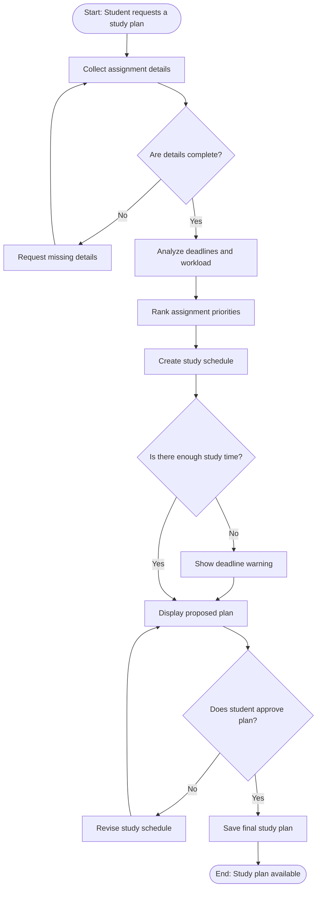

# Workflow of Tasks


## 1. Workflow Overview
### 1.1 Workflow Goal
This workflow supports the system goal defined in `my_first_agent/README.md`.

### 1.2 Workflow Trigger

The workflow begins when a student adds a new assignment, updates an existing assignment, or requests a new study plan. The system also runs automatically at the beginning of each week to review upcoming deadlines.

### 1.3 Completion Condition at Runtime
One workflow run is complete when the system has created and displayed a study schedule containing prioritized tasks, suggested study times, and any deadline warnings for the student to review.

### 1.4 General Workflow

First, the student enters assignment information, including the course name, assignment title, due date, estimated amount of work, and available study time. The system checks whether all required information is present. If information is missing or unclear, the system asks the student to correct or add the needed details.

Next, the system analyzes the assignment deadlines, estimated workload, and the student's available time. It uses AI to rank assignments by urgency and importance, divide large assignments into smaller tasks, and create a realistic study schedule. The system then displays the proposed schedule to the student for review.

The student can accept the plan or request changes. If the student requests changes, the system revises the schedule based on the student's feedback. If the system identifies that there is not enough available time before a deadline, it shows a warning and recommends prioritizing the most urgent work. The workflow ends when the student receives and approves or saves the final study plan.

### 1.5 Workflow Diagram

flowchart TD
Copy everything inside this box, from the first ```mermaid line through the last ``` line:


